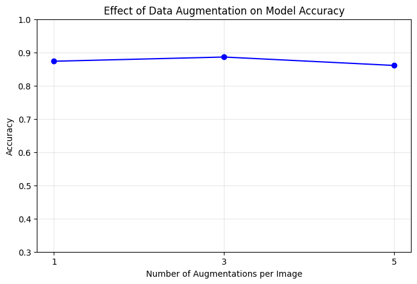

# Старт в Распознавании Лиц

Компактный и эффективный конвейер машинного обучения для распознавания и классификации лиц. Этот проект демонстрирует полный рабочий процесс: от загрузки данных и аугментации до обучения модели и оценки результатов, используя комбинацию OpenCV для обнаружения лиц и Scikit-Learn для построения классификатора.

## 🚀 Возможности

*   **Обнаружение лиц и предобработка:** Автоматически обнаруживает лица на изображениях с помощью каскадов Хаара и обрезает/изменяет их размер.
*   **Аугментация данных:** Реализует аугментацию изображений (поворот, смещение, отражение) для повышения надежности модели и предотвращения переобучения.
*   **Снижение размерности:** Использует Kernel PCA для эффективной работы с высокой размерностью image-данных.
*   **Модельный конвейер:** Строит надежный классификатор с использованием пайплайна со StandardScaler, KernelPCA и LogisticRegression.
*   **Комплексная оценка:** Предоставляет метрики точности, отчеты о классификации, матрицы ошибок и визуализацию предсказаний.

## 📊 Результаты

Проект исследует влияние аугментации данных на производительность модели. Результаты демонстрируют, что увеличение количества аугментированных образцов на изображение может привести к повышению точности на тестовой выборке.

*Пример графика точности из эксперимента:*

## 🧠 Детали модели

Основная модель представляет собой пайплайн, состоящий из:
1.  **StandardScaler:** Стандартизирует признаки, удаляя среднее и масштабируя до единичной дисперсии.
2.  **KernelPCA:** Нелинейное снижение размерности с использованием полиномиального ядра (`n_components=200`).
3.  **LogisticRegression:** Линейный классификатор, используемый для окончательного многоклассового предсказания.

## 🤝 Участие в развитии

Вклады, вопросы и запросы функций приветствуются! Не стесняйтесь проверить [страницу issues](../../issues).

## 📄 Лицензия

Этот проект лицензирован под лицензией MIT - подробности см. в файле [LICENSE](LICENSE).

---

*Если этот проект был вам полезен, поставьте ему ⭐!*

